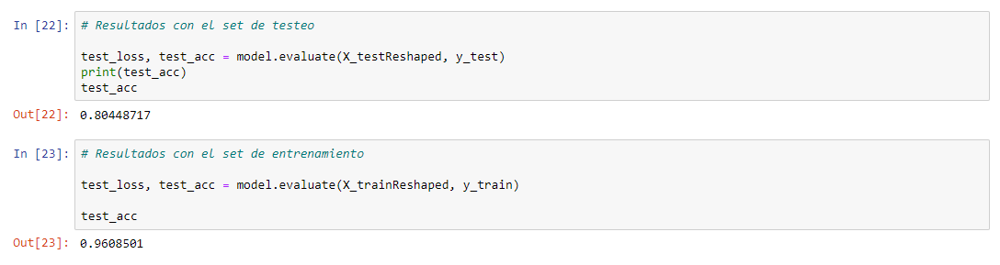

# ML - CNN - PNEUMONIA RECOGNITION

Machine Learning Convolutional Neural Network (CNN) project with Python.

## Used Tools

- Python
- Tensorflow
- TensorBoard
- Numpy
- Matplotlib
- Imblearn
- Skimage

## Dataset

- https://drive.google.com/open?id=1JNn0v0dF96vRrc0Gv6INZtpIa98r3zKH

## Results

## Captures

### Dataset

### Model

